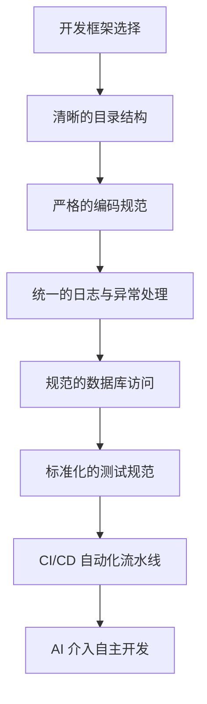
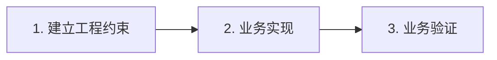

## **一、核心论点：先工程化，再智能化**

在 AI 辅助开发的时代，很多人一上来就会陷入对以下问题的思考：

> **“AI 应该怎么帮我做开发？”**

但这种思考方式实际上是本末倒置的。更合理的切入点，应当是首先明确：

> **“我们的软件工程规则和规范是什么？”**

只有先构建起清晰的工程边界与规则，AI 才能在这些约束之下高效、准确地工作。

当这一整套软件工程规范建立并明确之后，AI 实际上就已经具备了**“怎么开发”**的前提条件。接下来，我们只需要引导它去解决具体的业务逻辑。

## **二、AI 时代的软件开发三阶段模型**

基于“先工程化，再智能化”的理念，我们可以将 AI 时代的软件开发提炼为一个结构清晰的**三阶段模型**：

### **1. 第一阶段：建立工程约束 (Engineering Constraints)**
* **核心目的**：规定 AI **“怎么开发”**。
* **主要内容**：由人类架构师或高级开发人员主导，为项目沉淀出一套可执行、清晰的规范体系。这包括：
  * **架构与框架**：决定核心的技术栈和代码分层逻辑。
  * **目录与包结构**：定义规范的模块分布。
  * **编码与安全规范**：约束代码风格、代码健壮性以及基本的安全防控。
  * **日志与异常处理**：规定在何处打印日志，以及异常如何统一捕获与抛出。
  * **测试与部署规范**：规定单元测试的写法和 CI/CD 自动化流水线的触发机制。

### **2. 第二阶段：业务实现 (Business Implementation)**
* **核心目的**：告诉 AI **“做什么”**，而不是“怎么做”。
* **主要内容**：在这一阶段，开发人员不再需要向 AI 细致描述每一个技术细节，而只需抛出具体的业务目标。
  * **示例**：*“新增订单撤销功能。”*
  * **AI 的自主应对**：由于第一阶段的“工程约束”已经固化为项目的上下文，AI 会自动推断并决策：
    * 代码应该放在哪个 Package / 文件夹下；
    * 应该调用哪个 Repository 或 Service 模块；
    * 应该如何编写符合规范的 Log 和 Exception 处理；
    * 应当如何生成配套的单元测试和接口文档。
  * **角色转变**：AI 在此并非天马行空的“发明家”，而是成为团队中**遵守规范、高效执行的高级开发人员**。

### **3. 第三阶段：业务验证 (Business Validation)**
* **核心目的**：确认产出的代码**“是不是客户真正需要的”**。
* **主要内容**：当编码工作基本结束后，开发流程的闭环并未完成，人与 AI 需要分工合作完成最后的质量与价值确认：
  * **代码审查 (Code Review)** 与自动化静态分析；
  * **自动化测试与用户验证 (UAT)**；
  * **业务逻辑确认与上线验证**；
  * **长期的运维与指标监控**；
  * **价值所在**：尤其是**“业务确认”**环节，这涉及真实商业场景的博弈与人机交互，是目前 AI 无法替代的价值核心。

## **三、该模型的深层价值与行业启示**

### **1. 符合经典的软件工程思想，重新定义高级开发者的价值**
在传统的软件开发团队中，高级程序员（架构师）的价值往往不在于他写代码的速度有多快，而在于他能够制定出合理且易于维护的**开发框架 (Framework)**、**规范 (Standard)** 和**架构 (Architecture)**，从而让团队中的新人（初级开发）只负责聚焦于具体的业务实现。

在 AI 时代，这一分工模式依然奏效，只是具体的“业务实现者”从初级程序员变为 AI。人类高级开发人员的工作非但没有贬值，反而更加聚焦于“制定工程约束”和“把关业务验证”两端。

### **2. 解释了现代 AI 编程工具易用性飞跃的本质**
为什么像 Cursor、Claude Code 等工具在近年来的体验有了质的提升？这并非仅仅因为 Prompt 工程越来越精妙，而是因为 **AI 拥有了更强的“工程级上下文理解能力”**。

当 AI 能够瞬间理解一个大型工程从 `Controller` 到 `Service` 再到 `Repository` 的完整链路时，它就能瞬间适应公司的开发规范。你只需告诉它“增加订单取消功能”，它就能自动契合已有的编码风格、日志格式和测试规范，生成出近乎完美的业务代码。

### **3. 纠正“神化 AI”的认知误区：规范不是 AI 的负担，而是其发挥的前提**
很多关于 AI 开发的文章都隐含着一种逻辑：
> *“AI 越来越聪明了，所以软件工程可以被简化甚至抛弃。”*

然而，真实情况恰恰相反：
> **“AI 越来越聪明了，所以软件工程应该变得越来越规范。”**

规范与约束不是限制 AI 发挥的绊脚石，相反，它们是 AI 能力发挥的温床。**工程规则越明确、上下文越完整，AI 的产出就越稳定、越一致、越安全，也越容易被维护。** 

## **四、总结**

“先工程化，再智能化”的本质，是**将 AI 看作一个高度自律且高效的执行者，而将人放在“工程规则定义者”与“业务价值确认者”的位置上**。

通过建立“工程约束 -> 业务实现 -> 业务验证”的完整闭环，我们既能最大限度榨取 AI 的代码生成效率，又能牢牢把控软件系统的工程质量与商业价值。这才是 AI 时代真正可持续的软件工程治理实践。
