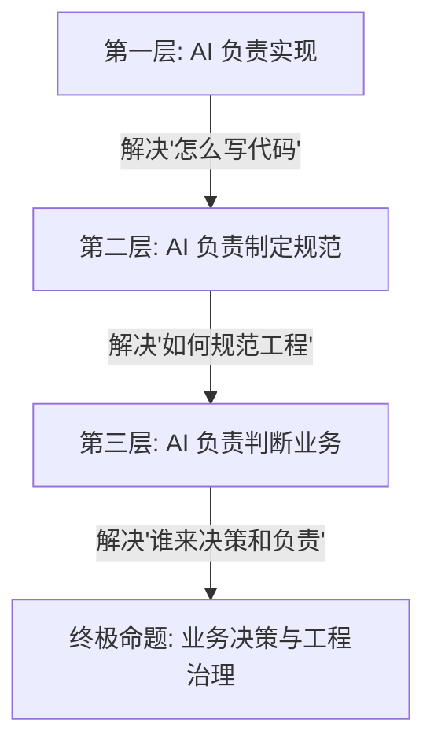

## **一、引言：从“如何编程”到“如何治理”**

在探讨 AI 如何改变软件开发时，很多人的关注点还停留在“Prompt 怎么写”或者“代码生成速度”上。然而，随着 AI 模型的快速演进，我们已经开始触及一个更深层次、更根本的问题：**AI 时代的软件工程治理 (Software Engineering Governance)**。

这个演进过程，可以被划分为三个逐渐深入的层次：

* **第一层：AI 负责实现（现已基本实现）**
  * 程序员提出需求（如“实现一个订单管理模块”），AI 负责编写并生成代码。在 Cursor、Claude Code 等工具的加持下，这一步已经非常成熟。
* **第二层：AI 负责制定规范（未来几年即将普及）**
  * AI 通过分析整个代码库，自动建议适合项目的架构和规范。例如：“本项目建议使用 DDD 架构，采用事件驱动模式，统一日志格式，且单元测试覆盖率需达到 80%。”程序员只需点击批准，后续整个项目便在 AI 自动维护的规范下演进。
* **第三层：AI 负责判断业务（这才是真正的难题）**
  * 客户提出模糊需求：“我需要一个审批流程。” AI 凭借通用经验建议：“建议使用三级审批流程。”
  * 但事实上，不同企业的业务场景差异巨大。三级审批是否符合公司的权责规定？审批顺序是否需要反向？AI 无法得知，甚至连程序员自己可能也需要与业务方进行多轮博弈才能明确。这已经脱离了技术实现，进入了**业务决策**的深水区。

## **二、核心命题：谁拥有最终的业务决策权？**

在业务决策的语境下，并不存在绝对的技术对错。

> AI 说：“按照库存管理最佳实践，应当采用先进先出（FIFO）原则。”
> 但企业因为特殊的财务或税务考量，硬性规定必须采用后进先出（LIFO）原则。

AI 无法通过“逻辑推理”得出这一结论，因为**这是企业自身的业务决策和主观选择**。

这也就推导出了“个人项目”与“企业软件”在 AI 时代完全不同的开发范式：

* **个人/低风险开发模式**：开发者只想快速上线一个记账 App，他们不在乎日志格式、系统架构或测试覆盖率，只要功能跑通即可。此时可以让 AI 代理全部工作并直接发布，因为**开发者自己承担全部风险**。
* **企业级软件开发模式**：企业系统牵涉资金、合同、法律、审计与安全。AI 可以协助定义规范、编写代码、运行测试，但 **AI 绝对无法承担任何法律或商业后果**。

## **三、风险驱动：我们到底要不要自己做测试？**

经常有开发者问：“既然 AI 能写测试，我们还要不要自己测？” 
这个问题的底层逻辑，其实取决于：**你愿意并能够承担多大的风险？**

* **场景一（低风险）**：开发一个计算 BMI 的小工具。AI 负责编写、AI 负责测试，开发者直接一键发布。即使出现计算 Bug，影响微乎其微，这种“全权托管”是合理的。
* **场景二（高风险）**：开发银行转账系统。AI 同样负责了开发与全部测试，作为程序员或项目负责人，你敢不看一眼就直接上线吗？

现在几乎没有企业敢这么做。这并非因为 AI 的技术能力不够，而是**因为没有人敢在责任真空中运行核心系统**。

## **四、AI 自治等级 (AI Autonomy Levels)**

为了更好地评估 AI 在软件工程中的参与度与治理边界，我们可以将 AI 的自治能力划分为以下四个等级：

| 自治等级 | 角色定位 | AI 职责 | 人类职责 | 适用场景 |
| :--- | :--- | :--- | :--- | :--- |
| **L0** | **AI 辅助工具** | 仅负责代码片段生成、函数补全。 | 负责架构设计、业务定义、代码实现与测试。 | 传统编码、复杂重构。 |
| **L1** | **AI 协作者** | 负责完整功能的代码实现。 | 负责核心架构、代码审查 (Code Review) 与测试。 | 常规业务功能开发。 |
| **L2** | **AI 高级工程师** | 负责架构建议、规范制定、代码编写及自动化测试。 | 负责业务决策、最终质量确认与价值把关。 | 大部分企业级业务模块开发。 |
| **L3** | **自主 AI 代理** | 全权负责需求分析、架构设计、代码实现、测试与自动上线。 | 仅进行极高层面的宏观目标设定，完全不参与细节。 | 低风险工具、标准化SaaS、个人验证项目。 |

从技术演进来看，**L3 自治在未来并非不可逾越**。在低风险、标准化程度极高的领域，AI 完全自主开发与部署会成为常态。

然而，在企业核心业务系统中，天花板并不是 AI 的技术极限，而是**责任的归属 (Accountability)**。

## **五、总结：治理的核心是责任归属**

如果一个系统上线后造成了数千万甚至上亿元的经济损失：
* AI 无法去法庭当被告；
* 企业不能把“这是 AI 做的决定”作为免责条款；
* 最终的法律责任与经济损失，依然必须由有法人资格的企业和人来承担。

因此，即使未来的 AI 将测试覆盖率做到 100%、代码零 Bug，企业在软件工程治理上仍将坚守一条底线：

> **AI 可以执行 99% 的工程落地，但涉及业务目标的定义、风险的接受度以及最终的上线决策，话语权必须牢牢掌握在具有责任主体的人类手中。**

AI 时代，我们讨论的终极问题已经不再是“AI 能不能写好代码”，而是**当 AI 几乎无所不能时，人类应当保留哪些核心决策权，以及如何建立人机协同的责任边界**。这才是软件工程治理的真正价值所在。
